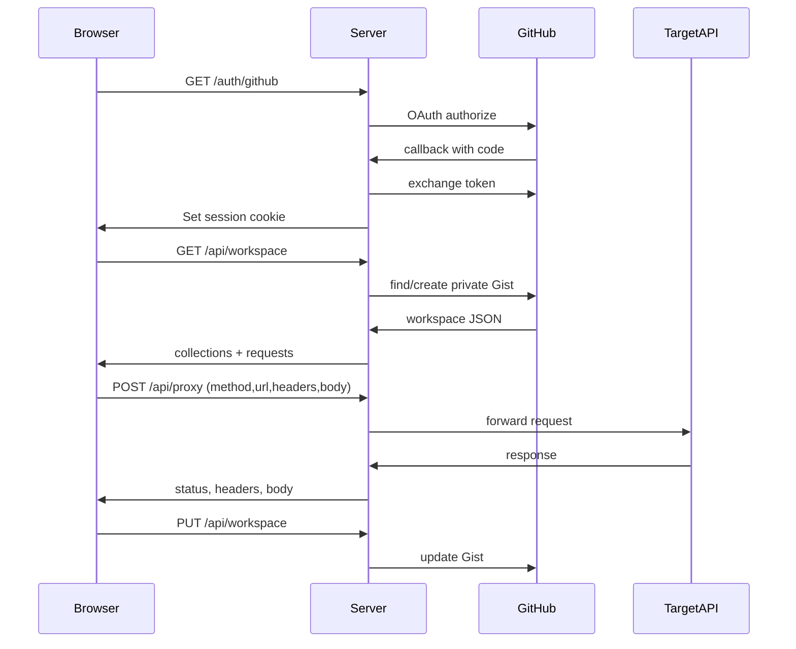

# Openputman: Postman-like client with GitHub storage

## Product MVP

A browser API client with Postman-style layout:

- Left: collection tree (folders + requests)
- Center: request editor (method, URL, params, headers, body)
- Bottom/right: response viewer (status, headers, body)
- Top bar: GitHub login, Save / Sync, logo

**Persistence:** no user database. After GitHub OAuth, create or update one **private Gist** (`openputman-workspace.json`) in the user’s account. Local edits sync on Save and on login load.

**Out of scope for v1:** workspaces/teams, mock servers, tests/scripts, GraphQL/WebSocket, import/export Postman format, environments UI beyond a simple key-value map stored in the same Gist.

## Stack (concrete)

| Layer | Choice |
|-------|--------|
| Monorepo | Root npm workspaces: `client/`, `server/` |
| Frontend | Vite + React + TypeScript |
| Backend | Express + TypeScript (OAuth + CORS proxy + Gist API) |
| Auth | GitHub OAuth App (authorization code); httpOnly session cookie |
| Storage | Private Gist via GitHub REST API (`gist` scope) |
| Branding | Orange/charcoal UI + landing rocket logo from assets |

Why Express + Vite (not Next): matches “node react”, keeps OAuth secret and request proxy off the browser, and avoids CORS failures when sending API requests from the page.

## Architecture



## Data model (Gist JSON)

```ts
type Workspace = {
  version: 1
  environments: { id: string; name: string; variables: Record<string, string> }[]
  activeEnvironmentId: string | null
  collections: {
    id: string
    name: string
    requests: {
      id: string
      name: string
      method: string
      url: string
      headers: { key: string; value: string; enabled: boolean }[]
      body: string
      bodyType: "none" | "json" | "raw"
    }[]
  }[]
}
```

Gist discovery: search authenticated user’s gists for description `openputman-workspace`; create if missing.

## Server routes

- `GET /auth/github` — start OAuth
- `GET /auth/github/callback` — exchange code, store `{ accessToken, login, avatar }` in signed cookie/session
- `GET /auth/me` — current user or 401
- `POST /auth/logout`
- `GET /api/workspace` — load/create Gist
- `PUT /api/workspace` — save Gist
- `POST /api/proxy` — forward HTTP request (timeout, size limit, block `file:` / SSRF basics: no private IP ranges)

Env: `GITHUB_CLIENT_ID`, `GITHUB_CLIENT_SECRET`, `SESSION_SECRET`, `CLIENT_ORIGIN`, `PORT`.

## Client UI

Postman-inspired dark shell with orange accent (`#FF6C37`), not a purple/cream template look.

- `client/src/App.tsx` — layout shell
- Collection sidebar: create collection/request, select active request
- Request pane: method select, URL, tabs (Params / Headers / Body), Send
- Response pane: status badge, time, size, Headers / Body tabs
- Auth gate: “Sign in with GitHub” landing with logo when logged out
- Autosave debounce optional; explicit **Save to GitHub** button required in v1

Copy logo into `client/public/logo.png` from the landing asset.

## Repo setup

- Branch: `feature/openputman-app` from `main`
- Root `package.json` scripts: `dev` (concurrent client+server), `build`
- `.env.example` with OAuth vars
- Update `README.md`: create GitHub OAuth App (callback `http://localhost:4000/auth/github/callback`), scopes `read:user gist`, how to run
- Extend `.gitignore` for `node_modules`, `dist`, `.env`

## Implementation order

1. Scaffold workspaces + TypeScript configs
2. Express: session, GitHub OAuth, `/auth/me`
3. Gist workspace load/save
4. Proxy endpoint with safety limits
5. React shell + auth gate + logo
6. Collections + request/response editor wired to proxy
7. Save/load workspace from GitHub
8. README + `.env.example`; smoke-run locally

## Success criteria

- Sign in with GitHub works locally with a developer OAuth App
- Create a request, Send, see response (via proxy)
- Save → private Gist appears on GitHub; reload restores data
- No app DB / no stored passwords

## Todos

- [ ] Scaffold npm workspaces (client Vite React TS, server Express TS) + branch
- [ ] Implement GitHub OAuth, session, Gist workspace load/save
- [ ] Implement `/api/proxy` with timeout and SSRF basics
- [ ] Build Postman-like UI: collections, request editor, response, Save
- [ ] README, `.env.example`, logo in public, gitignore
